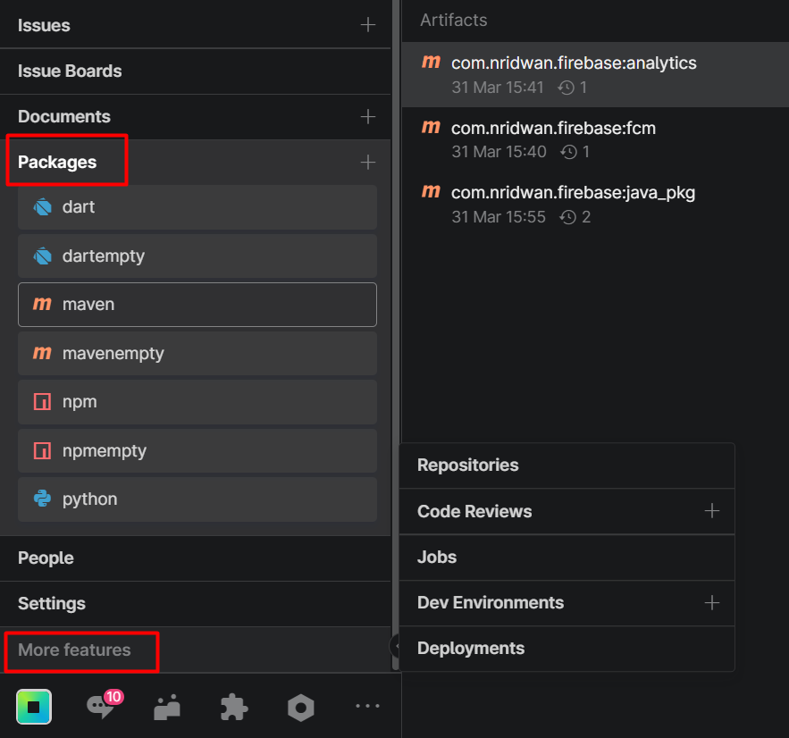
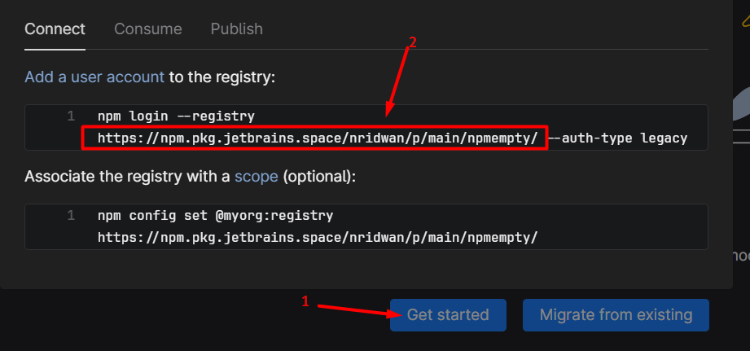
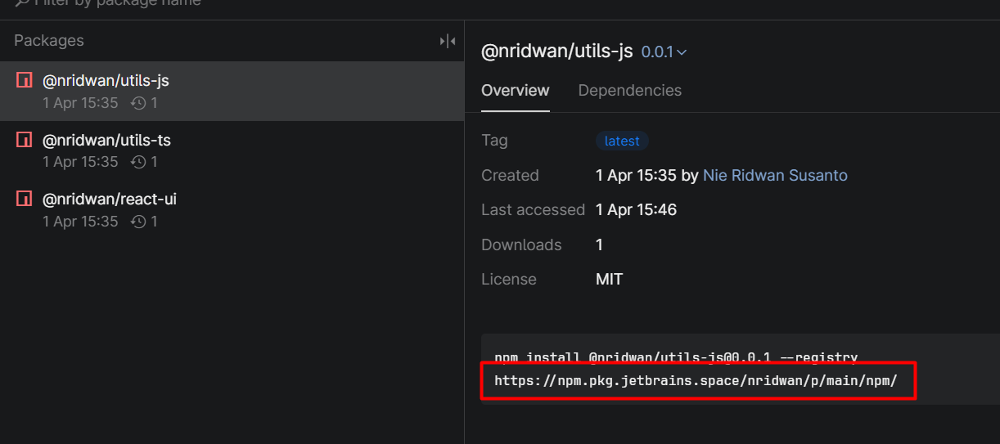

# Jetbrains Space Package Experiment

## What is this repository?
This repository is a personal experiment about how to publish certain language library to custom package repository, in this case personally tested on [Jetbrains Space](https://www.jetbrains.com/space/) platform.

## How to Use this repository?
First, make sure you already have custom package repository that's ready to use. 

For jetbrains space:
1. register new account and create new space, just follow the site, it's quite easy to understand, then login and open the dashboard
2. find packages on side menu / more features\

3. Click on new repository, select your desired repository, and click create
4. take note on url given for the repository. can be from "Get started" if still empty, or find any package, there should be link in any published package\
\

## Provided language example
1. [Dart](dart/README.md)
1. [Java](java/README.md)
1. [NodeJS](nodejs/README.md)