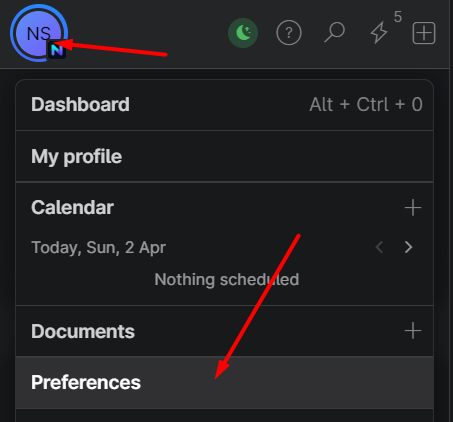
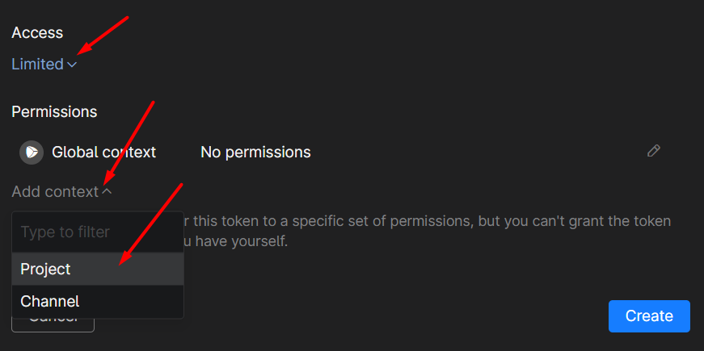
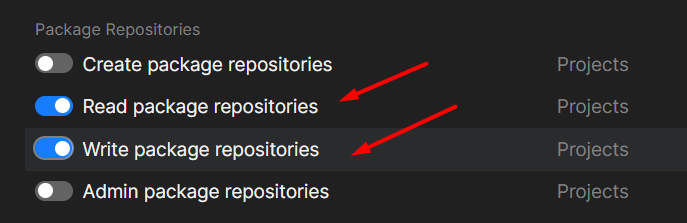
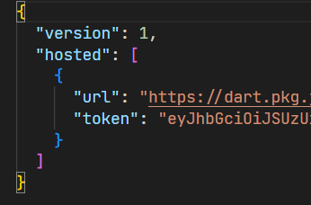

# Dart (and Flutter) Package Publishing/Usage Example

## Tools Needed
Make sure these tools installed and the command can be run through terminal/cmd/powershell (for generic terms we will use terminal in later section):
1. [Flutter](https://flutter.dev/)
2. [Dart](https://dart.dev/): Should be included in flutter
3. [Melos (v3+)](https://melos.invertase.dev/getting-started)

## Concepts
This example use monorepo concepts, where single workspace repository responsible for managing multiple package, and for that purpose we need melos to manage its dependencies

## Pre Configuration / Environment Setup

### Get Package Repository Token
for jetbrains space refer to these guide, for others please find out in each platform documentation:
1. Click preferences in jetbrains space dashboard\

2. Find personal token, then click "New Personal Token"
3. Configure name and expiry depends on your personal preference
4. make sure access limited, add context > project, select the project\

5. add read/write package permission, if you are only giving permission for package consumer, prefer limit it to read permission, then press save\

6. Press create, then a popup will show, copy the token and save it somewhere safe for later usage  

### Add repository token to system
1. execute this command on terminal `dart pub token add {packageurl}`, replace `{packageurl}` with url provided by package repository, for example:
`dart pub token add https://dart.pkg.jetbrains.space/nridwan/p/main/dartempty/`
2. Insert ~~the token~~ any random text when prompted. Because jetbrains space token size is too big and somehow windows can't handle it, not sure for other OS though, just try if you want to.
3. Open `pub-tokens.json` in your favorite text editor. it's location is in (since I'm windows user, for other OS if it's incorrect search it on google):
  - Windows: `%AppData%\dart`
  - MacOS: `/Users/username/Library/Application Support/dart/pub-tokens.json`
  - Linux: `$HOME/.config/dart/pub-tokens.json`
4. Update the token for your url using [token you've generated for the repository earlier](#get-package-repository-token), just format it to readable format for easier editing, then save.\


## Configuration
- For runnable example, dump it to examples, or make other directory
- You can add more directory for melos to manage in melos.yaml
- melos.yaml also can register custom script that intended to run command in batch
- For each relative dependencies, just state the package name and it's current version inside package.yaml as dependencies / devDependencies, also add hosted configuration. this is used to make sure melos version can auto increase the dependency versions. example:
```yaml
  dart_pkg:
    hosted: https://dart.pkg.jetbrains.space/nridwan/p/main/dart/
    version: ^1.0.0
```
- each publishing should create tag in the commit with format `{packagename}-v{version}`, for example `dart_pkg-v1.0.0`
- for each package that's intended to be pubblished, make sure to set `publish_to` properties in `pubspec.yaml` with package repo URL. for example:
```yaml
publish_to: https://dart.pkg.jetbrains.space/nridwan/p/main/dart/
```


## Development
1. Open root project, run `melos bootstrap`, this will make sure your local dependencies linked each other, you can check pubspec_overrides.yaml in each section for this mechanism
2. Run example by going to examples/basic_pkg_example and run the command `flutter run`

## Versioning
use `melos version` command in terminal from project directory (can be used in subdirectory, preferable to use in root directory) to increase package versions (also its dependencies) and automatically create changelog in each package `CHANGELOG.md` based on commits. melos will find commit history from last package version tag until latest commit for this changelog. open these links for further info about [available options](https://melos.invertase.dev/commands/version) and [detailed explanation](https://melos.invertase.dev/guides/automated-releases).

in short:
- commit message will be translated to changelog
- packages with changes will have its version increased based on commit importance and semantic versioning rules (included dart additional rule for semantic versioning). 
- relative dependencies version will be increased automatically

## Publishing
use `melos publish --no-dry-run --scope=pkg_name1,pkg_name2,other_pkg_name` command to publish the package to desired package repository defined in `publish_to` of pubspec.yaml. 

Note:
- `scope` option is used to limit which package intended to be published at same time.
- make sure token that you setup in [pre-configuration](#pre-configuration--environment-setup) have write permission
- make sure to publish it incrementally, if your published package have relative dependency. for example:
  - if `dart_pkg` is used in `flutter_pkg`, and latest version changes increase both version, `dart_pkg` should be published first before `flutter_pkg`, because the command will check remote dependency availability first, if not available it will be error

## Test the Publishing
1. go to examples/basic_pkg_example
2. delete pubspec_overrides.yaml if any. Warning: do not run melos bootstrap at this point
3. run `flutter pub get` from terminal inside examples/basic_pkg_example directory
4. run `flutter run` command inside the same directory with previous step