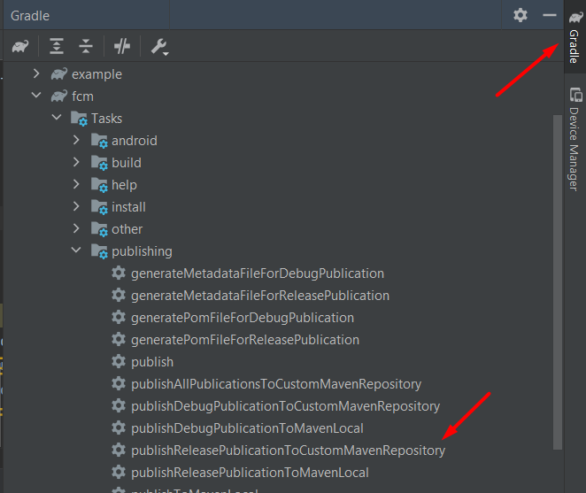

# Java (Android)

## Tools Needed
- Android Studio

## Concepts
In this example I use android studio project structure, which can contains as many modules as you want. 1 example modules for runnable and other publishable modules

## Publishable Modules
- fcm (android)
- analytics (android)
- java_pkg (pure java)

## Configuration
- copy `publish.properties.example` to `publish.properties` and edit it properly using package repositories url, username, and password, for example:
```properties
maven_url=https://maven.pkg.jetbrains.space/nridwan/p/main/maven
maven_username=username
maven_password=password
```
Note: in jetbrains space use the login account.

## Development
1. Open root project with android studio
2. Make sure `example/build.gradle` content is the same / replaced with `build-local.gradle`
3. run example

## Publishing
- edit the package version by going to `{packagename}/build.gradle`, and change `version` properties inside `publications`
- run `./gradlew {packagename}:publishReleasePublicationToCustomMavenRepository` or just find the command from android studio\


## Test the Publishing
1. Open root project with android studio
2. Make sure `example/build.gradle` content is the same / replaced with `build-remote.gradle`
3. Make sure dependencies version the same as published version
4. run example

